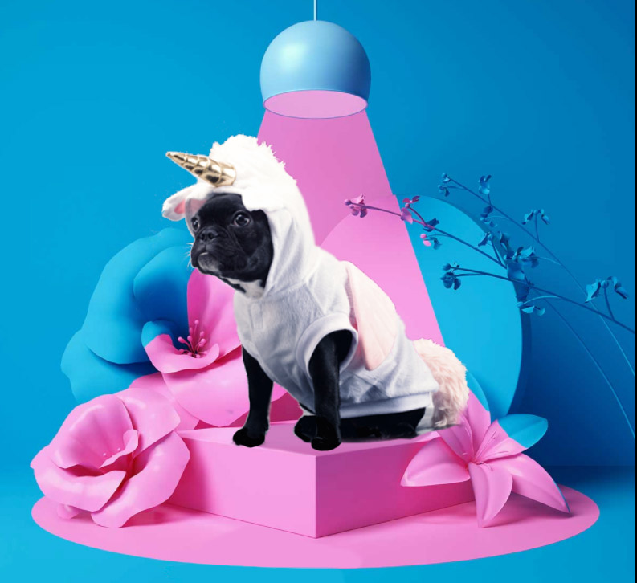

## Are you our next SEO Unikorn?

We are currently looking to top up our capacity to deliver magic and top of class SEO to our clients. For this, we need more Unikorns. 

#### About Unikorn

*Unikorn is a Sweden based digital agency focusing on owned traffic, web projects and digital strategy. Today we are three Unikorns, plus a handful of freelancers who help us when needed. We are a small agency, and working with us means that you automatically become a key person.*

*At Unikorn, we strive to work with the core values ​​of professionalism and low prestige. We only deliver the highest quality, while developing each other's strengths by lifting each other, supporting the work we do and putting the team before the self, to create a respectful atmosphere. We like results (and we always get them), but not so much go-getters with more feeling for the self and less feeling for the team.*

*We are invested in being an industry leader in SEO and digital strategy in Sweden by having fun at work and letting the creative drive decide the direction. It is very important to us that we help our customers reach their full potential in their digital presence. To achieve this, we work process-driven in projects, where we always put the end-user in focus. To help us, we use software such as Semrush, Ryte, Searchmetrics, ContentKing, Screaming Frog, all Google tools and more.*

### What we see as Unikorn material

* Just like us, you need to really love SEO. We breath, sleep and eat SEO. Make jokes about it, have deep talks about SEO, reference other life stuff with it and sometimes dream about SEO. 
* You have a few years of experience of the SEO business and feel comfortable with taking the initiative and lead on projects.
* It's a must to be analytical and creative at the same time. You will have meetings with our clients and have to help them take the next steps in their success stories. 
* We have a SEO-test you will have to do, and we will asses just how much an SEO-star you are, but you don't have to know everything. We want you to feel you have room to grow and there will be plenty of learning opportunities. 
* There won't be any need for you to sell in your own time (unless you want to, and like the sales role).  
* This role is not geographically bound to Sweden (or any other location), but it would be much easier if you know some Swedish :) 

### What you can expect as a Unikorn

* Interesting work that will give room for your own development.
* We don't work nine-to-five eight-hour days, we do our magic when we are creative and as long as the Unikorn dust sprinkling is done in time, everyone is happy. However, sometimes clients have demands on meetings, and those we need to be at while looking representable. 
* We are currently working with a handfull large e-commerce sites and a few medium sites.
* If you have a dream client, we can pitch for them together and make that dream come true!  

#### If this sounds like you! [Click this link and apply today! ](https://forms.gle/i4XV9JsAtEog8DtU8)

Do not hesitate to ask any outstanding questions, email [hello@unikorn.se](mailto:hello@unikorn.se)