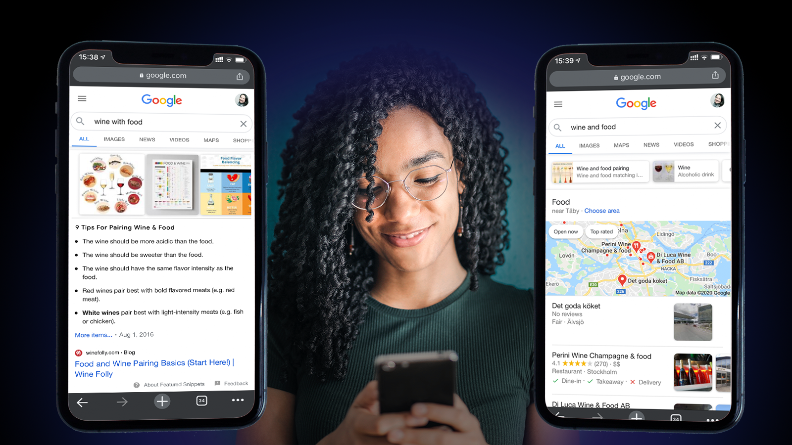
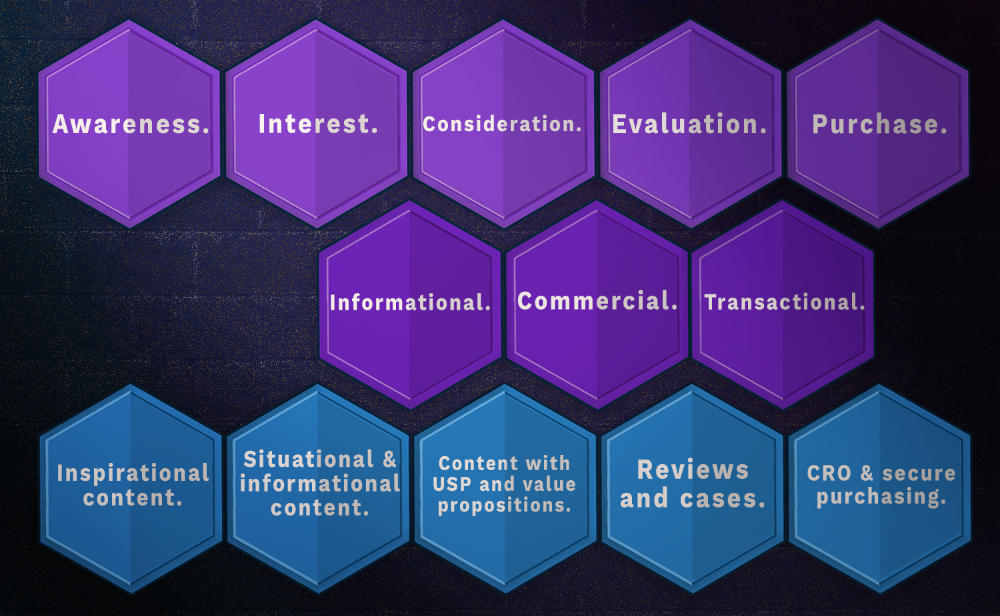

**Marketers have used the custom journey model for years, for tailoring the right message at the right time for the right person.** This is crucial in a landscape where all advertisers fight for  the customer’s attention and money. Now, we should bring that model to search and create a search customer journey, focusing on what the customer is looking for and returning relevant content! 

Some time ago, I was interviewed for a podcast about what a modern keyword research process looks like, and how I do it. Keyword analysis is an essential part of the SEO work, but done wrongly it can actually be more hurtful than helpful. 

It is easy to lose sight of relevance, especially when we start chasing golden nuggets. You know, that magic low or medium competition keyword with tons of search volume. That unused search phrase everyone is using when searching and none of the competitors are using. **You know what I am talking about - A low hanging fruit!** 

Just remember - not everything that glitters is gold. It is easy to be blinded and lose sight of relevance when you narrow down on looking for keywords for a specific page or topic. Let me give you an example.

In Sweden you cannot pick up a bottle of wine at the supermarket, we have something called Systembolaget. It is the government-owned chain of liquor stores for beverages with an alcohol percentage over 3,5%. They are very helpful when it comes to picking the right kind of wine or beer. Many of the salespersons are trained sommeliers and you can get advice on wine and food pairings on their site. 

I noticed that Systembolaget had optimised their pages about what type of beverage to pair with a specific dish with the search phrase “*wine and food*” instead of “*wine with food*”. “*Wine and food*” has a much higher search volume than the phrase “*wine with food*” and they are very similar. But the search intentions are different. 

When googling the two phrases you can see there is a difference in how Google interprets the search intent behind the phrases. Where the one is about food pairing and the other about where to wine and dine.

What happens when you miss the mark of relevance, is that you get a lot of impressions and clicks, but also lots of bounces and other signals telling you your visitors weren't happy with what you served them. It’s easy to lose sight without a strategy. **Let’s up the game a bit and do a Search Customer Journey!**

A search customer journey is the traditional customer journey model used by your marketing department, with a layer of search intent on top of it. Then, add content touch points and we end up with a site structure that is relevant for all users, throughout the whole decision process!

The customer journey model is a model of a decision process. The model is supposed to reflect users going from one phase to the other and the other etc, until making a conversion. We all know this is actually not how a human mind works and not how everyone is deciding on their purchases. We jump back and forth all over the place. It doesn’t matter - the model still works as a model.

Closely connected to the customer journey, there is the model of search intents, with the four different intents and the different kinds of searches associated with them. They represent different types of search intents such as informational, navigational, commercial and transactional.

**If combining these two models and adding touch points - we get a Search Customer Journey!**

Informational searches cover the phases of interest to a consideration and then commercial and transactional searches take part. As Navigational searches deal with branded searches, they kind of cover more or less all phases, or none, depending on the actual search phrase.

## The search customer journey model

After we add everything together, we get a map of a full search customer journey, with phases that set the tone of the communication, search intents and the associated searches and lastly the touch points where you meet and talk to the user with relevant content based on their target group, their needs and their decision process.

Now you have a solid foundation for your keyword strategy. Page by page. Tone of voice, keywords, goals with the content and ultimately what to measure and what KPIs to use.

You can also take this a step further, and build your entire content structure and content plan, based on a keyword strategy that focuses on what content will be the touch points where you meet your customers!

Because a more relevant and intuitive content structure that delights your users, will make them trust you more and eventually buy more often from you. And as we say: happy users - happy search engine and happy search engine ranking your content gives a happy business!

## Awareness

If looking at each phase individually, we see that in Awareness - the phase where users are not actively looking for your brand, product or services but accidentally see or find it while doing something else. The goal is to tag into the target group the user is in, at the touchpoint they like, and make them notice you.

Yes, this is very hard! We are all in a few hundred awareness phases at any given time. The Brands all compete for our attention. The ones who get it - are the ones we feel are talking directly to us. You do this with inspirational, light and humoristic/smart communication on other platforms and other types of marketing.

## Interest

If the brand indeed caught the users attention, the user might be a bit interested in knowing more about the brand, product or service and hopefully they start googling. They search for generic pieces of information, questions and broader topics. The goal here is to make the user even more interested in the product or service.

You do this by meeting the user on the search engine, with well written titles and descriptions, leading to a landing page where you reflect the problem the user might have. Be creative - you can pinpoint most of them. If you can't, ask customer services what your customers need you stuff for.

## Consideration

If you succeed in convincing the user to consider that there is a need and the solution for that need might be your product or service. The user starts searching for more details using more long-tail searches, more detailed questions and generic product searches. The goal is to make the user consider your solution, when the user needs it.

Yes, you are there in the SERP again, this time with a stronger and more USP focused result and set of product pages, with the full arsenal of value propositions and arguments on why you indeed have the remedy for their itch.

## Evaluation

The user has more or less decided that they do need what you are selling. They are just not convinced yet that you and your product or service are the best option in providing them with it and are now evaluating their options. The potential customer searches to see if another provider has a better solution, if there is someone else who has bought the product and made a review on the interwebs. The goal is to make the user feel secure enough to choose your brand before any competitors.

There is probably money involved in the decision, and the users are careful who they give their money to. You need to dazzle the customer with your top of the line services, 5-star reviews and warm recommendations, so that soon-to-be buyers don't buy somewhere else.

## Purchase

The user clicked on the buy-button and the thing is now in the cart. One more thing before you have a done conversion - payment. The customer wants the best deal, and doesn’t really believe you when you say you have the best there is. They go back to google and search for lower prices, discounts and coupons. If they also live in Sweden, they will definitely search for a smoother and faster delivery option (that doesn’t involve waiting a month and paying extra taxes). The Goal is to make the user stay and go through with the conversion, without leaving the basket before check-out.

Many users are also concerned with the available payment options. Giving up credit card numbers on the internet is not hot anymore. You make the user stay by having all the information needed about all these concerns, visible. Have an ongoing CRO process implemented, see where the drop offs are.

## More questions?

If you want to discuss this further about how your company can implement a Search Customer Journey, please give me shout!