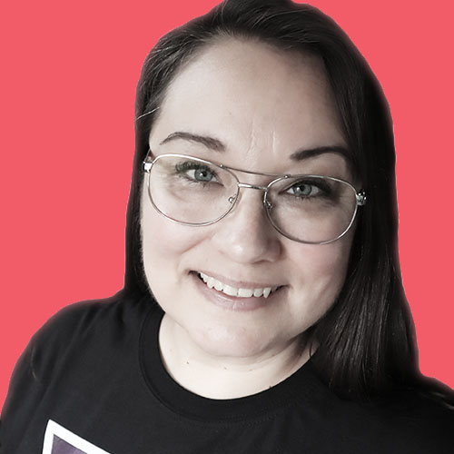

## Agency Owner and Senior SEO Unikorn

### Ulrika's Story

Ulrika has worked in the search business since 2007, with both organic and paid search, in-house and as a consultant. Before starting her own agency, she worked with a few of the largest companies in the world, such as ebay, Rocket Internet, eDreams and Omnicom Media Group. Ulrika started Unikorn in 2016 in order to be a full-time consultant at eBay Classifieds Global Growth Team. In 2018, Ulrika decided to take on multiple clients and converted Unikorn to an agency.

### Ulrika’s super powers

* Technical SEO and JavaScript SEO
* Digital Strategies and Content Strategies
* PR SEO and Content Marketing
* Product Owner and Project Manager

### What makes Ulrika’s inner Unikorn jump around with joy?

> When I’m not optimising my clients websites, or helping them setting their goals and strategies, I love to do various art and crafts projects, like photographing, painting, sewing or stitching. Beautiful things make me happy :)
>
> I also love to ski downhills and mountain hiking. I grew up in the north of Sweden, we had sleigh dogs and spent a lot of time in the big wild Swedish forests.
>
> If there is a good book to read, I don’t say no to that either.

### Fun facts you didn’t know about Ulrika

* Ulrika won a county championship in moped driving 1988, in her county.
* Once she was clocked skiing downhill (on a rather slow run) at 78 kilometers per hour.
* She is a killer at grammar and conversational analysis.