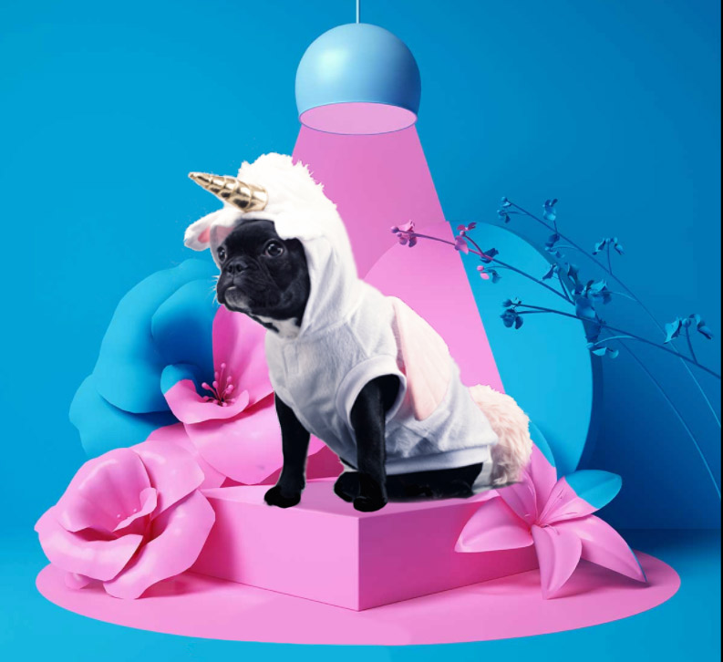

### Story

Sara has been working with digital strategies and web analytics since 2018. 📈 She loves to take on new challenges and projects. During her first four years in her digital career she has been working with digital strategies at 2 agencies, one media house and as a freelancer before deciding to become a thoroughbred Unikorn 🦄. Besides working at Unikorn, Sara is working with digital marketing for a training studio. 🤸‍♀️

### Sara’s super powers

* Google Analytics
* Data based Strategies
* SEO 

### What makes Sara’s inner Unikorn jump around with joy?

> “Besides challenging myself with web optimization, I love to dance, to entertain myself with DIY interior design projects, sailing and spending time with friends and family.”

### Random facts you didn’t know about Sara

* Sara is a silver medalist in Swedish Championships in Pole Sports. 🥈
* Sara has been a member of a (friendly) motorcycle club “Motorcykelentusiasterna” since birth. 🏍️