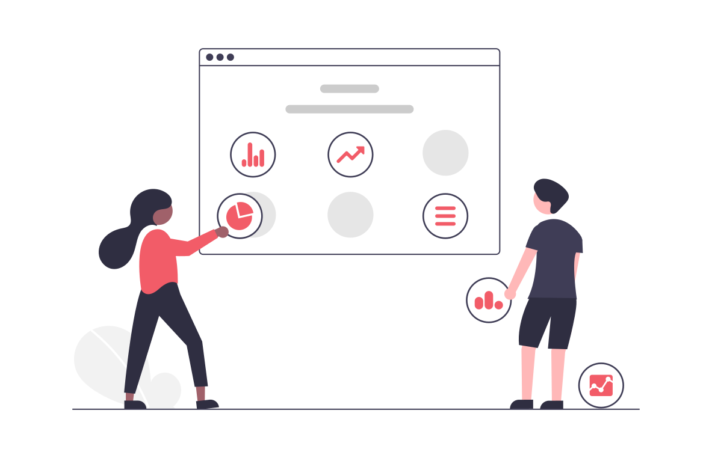

## Common Challenges

Many companies struggle to collect relevant data efficiently. Common challenges include complex web structures, difficulties in tracking specific interactions, or handling large volumes of data. These obstacles can, if not carefully monitored, create misleading data, which in turn negatively affects business decisions. 

## Our Process

1. **Analysis of Current System:** Review of existing web structure and data collection methods to identify shortcomings and areas for improvement.
2. **Plan and Custom Solutions:** Creation of a customised plan that suits the company's specific needs and [defined KPIs](https://www.unikorn.se/web-analytics/kpi-definition/). Choice and implementation of appropriate technology for collecting relevant data. 
3. **Implementation and Integration**: Installation and configuration of tags on the website. Integration with analytics platforms for data storage and analysis.
4. **Quality Assurance and Testing**: Testing to ensure that all data is collected and presented correctly.
5. **Monitoring and Adjustments:** Monitoring of system performance and data quality over time. Regular updates and adjustments to stay up-to-date with new trends and technologies.

## The Value of User Data

Investing in analytics and tag management is key to increased customer insights and measuring site performance. With the right data at your disposal and a thought through data visualisation, you can make well-informed decisions for increased customer satisfaction and return on investment.

Welcome to contact Unikorn to unlock your site's full potential!

**[Contact Unikorn](https://www.unikorn.se/contact/)**

