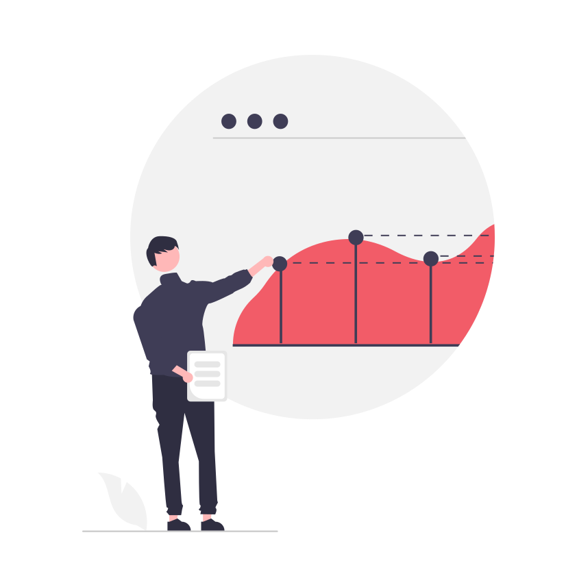

## Vanliga utmaningar 

Att navigera i all tillgänglig data upplevs ofta överväldigande. Många företag kämpar med att göra sin data meningsfull och användbar. Vår expertis ligger i att identifiera och extrahera de mest värdefulla och relevanta datapunkterna[.](https://www.unikorn.se/sv/webbanalys/definiera-kpi/) 

## Unikorn’s process för datavisualisering

1. **Förståelse av affären:** Vi börjar med att skapa en strategi för vilken data som skapar faktiskt värde för dina affärsmål genom vår [KPI-process](https://www.unikorn.se/sv/webbanalys/definiera-kpi/).
2. **Kvalitetssäkring och tillgänglighet:** Vi analyserar tillgänglig data för säkerställa att nödvändig data finns tillgänglig, och är pålitlig genom vår process för [effektiv datainsamling](https://www.unikorn.se/sv/webbanalys/datainsamling/).
3. **Användarvänliga rapporter:** Vi designar varje visualisering med mottagaren i åtanke, för att säkerställa att den inte bara är informativ utan också lätt att förstå och engagerande.
4. **Feedback och iteration:** Genom nära kontakt med kunden tar vi in feedback för nödvändiga justeringar. Genom samarbete säkerställer vi att varje visualisering blir relevant och effektiv.
5. **Löpande analys:** Vid behov levererar vi regelbundna utskick av data visualiserat i effektiva dashboards med tillhörande analyser och rekommendationer från datadrivna insikter.

## Fördelarna med effektiv visualisering

Genom att tydligt presentera komplex data hjälper vi dig att med datadrivet beslutsfattande och strategier. Våra visualiseringar erbjuder konkreta insikter som bidrar till värdeskapande beslut och handling. Genom effektiv filtrering, bearbetning och presentation av din data, kan vi hjälpa dig att uppnå bättre affärsresultat utifrån datadriven förståelse.

Unikorn är redo att hjälpa dig att förvandla data till insikter.

[Kontakta Unikorn.](https://www.unikorn.se/sv/kontakt/)

