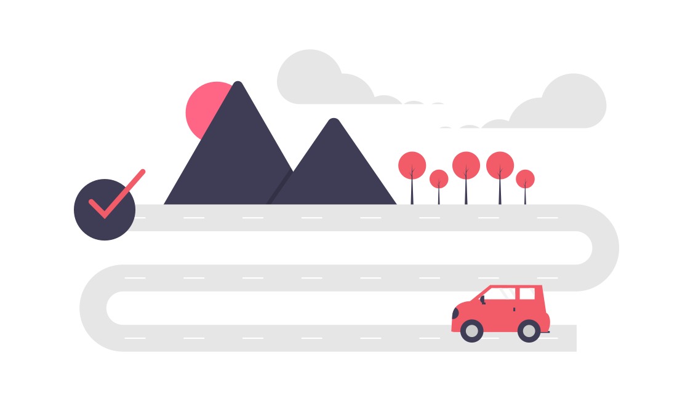

## Vanliga utmaningar 

I många fall läggs stora investeringar på att driva in trafik till sin webbplats via annonsering eller SEO, men att det saknas fokus att ta tillvara på att trafiken är relevant och skapar riktigt värde genom konvertering. Detta misstag hänger ofta ihop med att sina målsättningar och [KPIer](https://www.unikorn.se/sv/webbanalys/definiera-kpi/) lägger fokus på kvantitet snarare än kvalitet.

Konverteringsoptimering handlar om att förstå användarens behov och upplevelser genom hela resan mot att konvertera. För att lyckas krävs rätt kommunikation på rätt ställe, en användarvänlig struktur för att skapa enkla och engagerande navigeringsmöjligheter mot konvertering och att inga tekniska hinder såsom trasiga funktioner eller långsamma laddtider får besökaren att avbryta sitt besök.   

## Vår process för optimering

1. **Nulägesanalys:** Vi börjar med att analysera nuvarande trafikflöden på webben för att kartlägga hur innehållet presterar och var användare avbryter sin kundresa. 
2. **Målgruppsanalys:** Genom sökordsanalys identifierar vi målgruppens största behov i resan mot konvertering enligt vår modell för [Sökkundresan](https://www.unikorn.se/sv/blogg/search-customer-journey/). 
3. **Strategi:** När vi har skapat oss en bild av nuläget av webbens prestation för konvertering, så prioriterar vi åtgärder efter vad som är mest värdeskapande utifrån affären och användarna.
4. **Implementering:** För att få både effektiva och hållbara resultat rekommenderar vi generellt implementering av enklare justeringar som snabbt kan gå ut i produktion parallellt med mer omfattande investeringar för att webben ska prestera över längre sikt. Om möjligt rekommenderar vi att större förändringar implementeras stegvis för att effektivt kunna spåra dess påverkan genom A/B tester.
5. **Uppföljning och iteration:** Efter varje implementering följer vi upp resultatet i syfte att få värdefulla insikter för vidare förbättring och optimering. 

## Värdet av konverteringsoptimering

Genom att förbättra konverteringsgraden kan företag effektivt öka avkastningen av sina investeringar. En högre konverteringsgrad leder till högre försäljning och intäkter utan att nödvändigtvis öka trafiken till webbplatsen. Konverteringsoptimering syftar till att specifikt attrahera den lönsamma målgruppen och göra det attraktivt för dessa att genomföra det som ger värde till verksamheten.

När vi optimerar för konvertering förbättras av naturliga skäl även användarupplevelsen genom investeringar med användaren i fokus, vilket i sin tur stärker kundlojalitet och varumärke.

Vill du ha hjälp att öka din webbsidas lönsamhet?

[Kontakta Unikorn](https://www.unikorn.se/sv/kontakt/)

